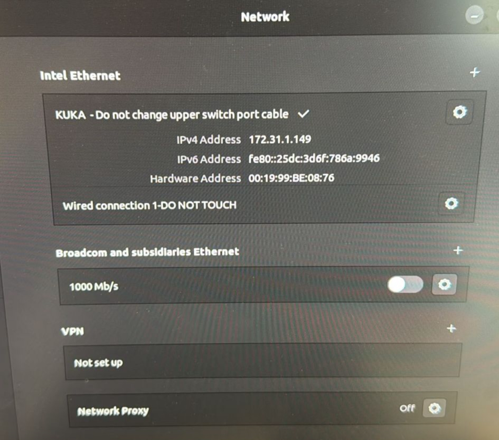

# Network IP Conflict — KUKA / PC "Do not change" Error

Summary
-------
This README documents an observed network/IP issue where a KUKA device and a PC appear to be on the same IP/subnet or there is a configuration warning shown in the desktop Network settings. The supplied images (Image 1, Image 2) show a handwritten troubleshooting note and the Linux desktop Network panel showing an interface named "KUKA - Do not change upper switch port cable" with IPv4 172.31.1.149.

Purpose
-------
- Capture the observed symptoms and environment.
- Provide reproducible steps, diagnostics, and recommended fixes/workarounds.
- Provide a clear format you can copy into your repo as README.md.

Screenshots / Attachments
-------------------------
- Image 1: Handwritten troubleshooting notes (provided by user)
- Image 2: Desktop Network panel showing "KUKA - Do not change upper switch port cable" and IPv4 172.31.1.149

Symptoms
--------
- Desktop shows an interface named with a warning: "Do not change upper switch port cable".
- IPv4 address displayed: 172.31.1.149
- Possible duplicate IPs or incorrect cabling between KUKA robot controller and multiple PCs.
- Network connectivity issues for machine control or development PCs when cables or switch ports are changed.

Impact
------
- Robot or machine control connectivity can be lost.
- Multiple PCs can conflict on the same network; automation or production may be disrupted.
- Risk of accidentally breaking a device by changing a protected switch/cable.

Environment
-----------
- OS: Linux desktop (GNOME Network panel shown in screenshot)
- Device: KUKA robot or controller on local 172.31.1.x network
- Network: Managed switch with labeled/locked ports ("DO NOT TOUCH")
- Subnet mask (likely): 255.255.255.0 (handwritten notes mention this)

How to Reproduce
----------------
1. Connect a PC to the same switch port or VLAN used by the KUKA controller.
2. If the PC is configured with a static IP in the 172.31.1.x range that collides with the controller, duplicate IP behavior appears.
3. Open Network settings on the PC and observe the interface name and IPv4 address (as in Image 2).

Diagnostics & Commands
----------------------
Use these commands (run on affected Linux PC) to gather diagnostics:

- Show interface addresses:
```
ip addr show
```

- Show routing table:
```
ip route show
```

- Check ARP table (detect duplicate MACs for same IP):
```
arp -n
# or
ip neigh
```

- Ping and show ARP while monitoring:
```
ping -c 4 172.31.1.149
arp -n | grep 172.31.1.149
```

- Check which process may be binding an IP (if relevant):
```
ss -tunlp
```

- Use `tcpdump` to inspect traffic on the interface (requires root):
```
sudo tcpdump -i <interface> host 172.31.1.149 -vv
```

Root Causes (common)
--------------------
- Static IP collision: two devices (PC + KUKA) share the same IPv4.
- Misplugged cable: PC plugged into KUKA port or wrong switch port that bridges to robot.
- Incorrect DHCP assignment or absence of DHCP causing manual IP assignment overlap.
- Misconfigured VLANs or switch port security that moved the device into the wrong network.

Immediate Workarounds
---------------------
- Do NOT unplug or change labeled cables if it's marked as "DO NOT TOUCH" for production devices.
- If safe and authorized: temporarily move the troubleshooting PC to a different, isolated switch port or a known workstation VLAN.
- Change the PC to use DHCP (if network DHCP exists and is authorized) or assign a different static IP outside 172.31.1.x (only if allowed).
- Coordinate with network/automation team before any active changes.

Recommended Permanent Fixes
--------------------------
1. Inventory and label: Ensure each device on the network has an inventory entry (hostname, MAC, intended IP).
2. Use DHCP reservations for all controllers and critical devices.
3. Lock/secure switch ports and enable port-based VLANs so non-authorized devices don't end up on the control VLAN.
4. Add documentation at the machine (signage


