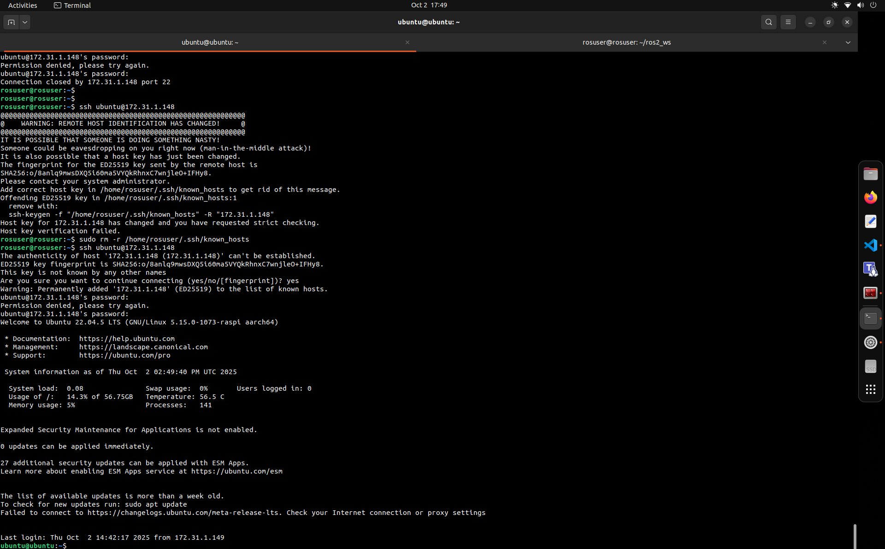

# SSH Connection Troubleshooting Guide

## Error Message

When attempting to connect via SSH, you might encounter the following:

Permission denied, please try again.
Permission denied, please try again.
Connection closed by 172.31.1.148 port 22
WARNING: REMOTE HOST IDENTIFICATION HAS CHANGED!
It is possible that someone is doing something inappropriate!
Someone could be eavesdropping on you right now (man-in-the-middle attack)!


## Cause

The error occurs because the remote host identification has changed. This usually happens if:

- The SSH key for the host has changed.
- There are multiple entries for the same host in your `known_hosts` file.

## Solution Steps

### 1. Remove the old host key

```bash
ssh-keygen -R "172.31.1.148"
```

Or to remove all known hosts:

```bash
sudo rm -r /home/rosuser/.ssh/known_hosts
```

### 2. Attempt to connect again

```bash
ssh rouser@172.31.1.148
```

### 3. Confirm the new host key

When prompted:

The authenticity of host '172.31.1.148 (172.31.1.148)' can't be established.
ECDSA key fingerprint is SHA256:...
Are you sure you want to continue connecting (yes/no/[fingerprint])?

Type `yes` to add the new host key to your `known_hosts` file.

Additional Checks

Make sure you are connecting to the correct IP address and username.

Verify that the SSH service is running on the remote server:

```bash
sudo systemctl status ssh
```
Security Notes

Do not ignore host key verification warnings.

Regularly check and maintain your SSH configuration and known_hosts file.

If this issue happens frequently, confirm that the server's IP address or hostname has not changed unexpectedly.




